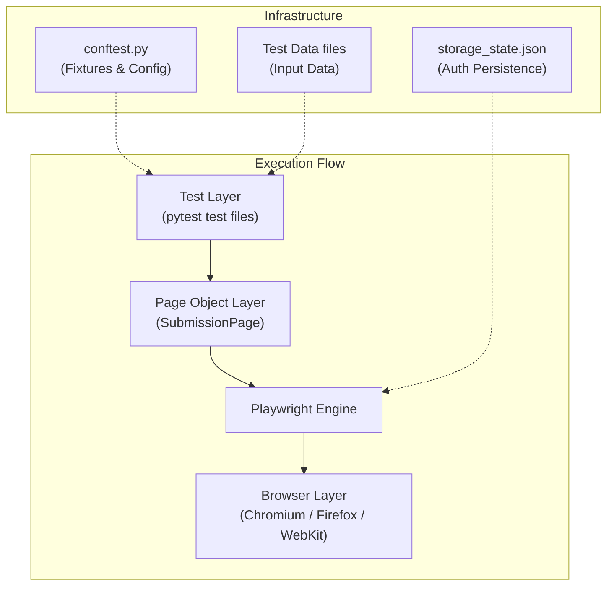
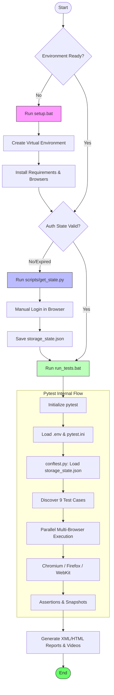

# LMS Automation Project (Python Playwright)

## 🏗️ Framework Architecture



## 🔄 Running Flow



This project provides an automated testing framework for LMS assignment submissions functionality.

## 📁 Repository Structure

- **`code/`**: Contains all automation logic.
  - **`pages/`**: Page Object Model (POM) classes.
  - **`tests/`**: Test cases (pytest).
  - **`auth/`**: Storage for login state (`storage_state.json`).
- **`data/`**: Contains dummy files for testing (PDF, ZIP, etc.).
- **`.env`**: Configuration for the target URL.
- **`requirements.txt`**: List of Python dependencies.
- **`pytest.ini`**: Pytest configuration settings.
- **`setup.bat`**: Windows batch script for environment setup and portability.

## 🚀 Getting Started

### 1. Initial Setup
Run the `setup.bat` file in the root directory. This will:
- Create a virtual environment (`venv`).
- Install all necessary dependencies from `requirements.txt`.
- Install the required Playwright browsers (Chromium, Firefox, WebKit).

### 2. Configuration
Open the `.env` file and set the `TARGET_URL` to the LMS environment you wish to test.
```env
TARGET_URL=https://your-lms-url.com
```

### 3. Running Tests
Once the setup is complete, you can run tests using `pytest` from the root directory:

- **Run all tests on all browsers (Chromium, Firefox, WebKit):**
  ```bash
  venv\Scripts\activate
  pytest
  ```

- **Run a specific test file:**
  ```bash
  pytest code/tests/test_assignment_submission.py
  ```

### 4. Capturing Authentication State
If your `storage_state.json` is missing or expired, use the utility script to log in manually and save a new session:
```bash
python scripts/get_state.py
```
This will open a browser to your `TARGET_URL`. Log in manually and **close the browser window** once you are logged in. The session will be saved to `code/auth/storage_state.json`.

## 📝 Test Scenarios
The suite covers the following scenarios:
- Valid file upload (< 20MB).
- Submission before/after deadline.
- Boundary testing (20MB and 20.1MB files).
- Negative testing (corrupted files, empty submissions).
